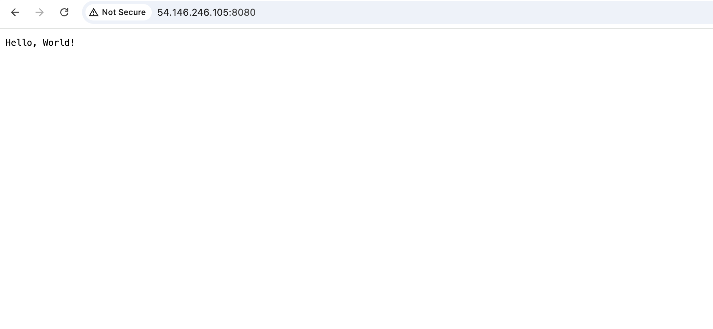

# Building Hello World GoLang app in docker

## docker build and run output

## docker ps output

## Output of curl command from VMA

## Test outside VM in browser

## Output of container logs 
docker logs hello-world

