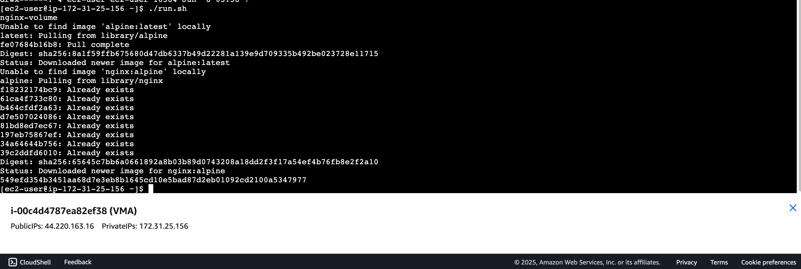
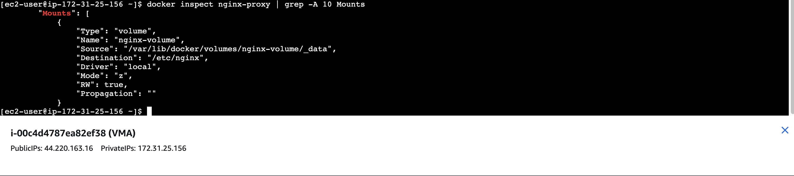
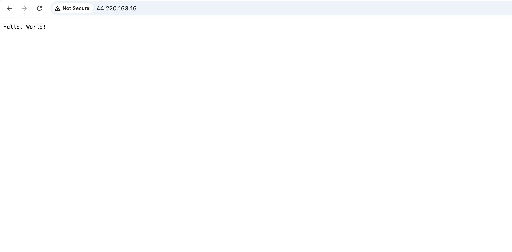
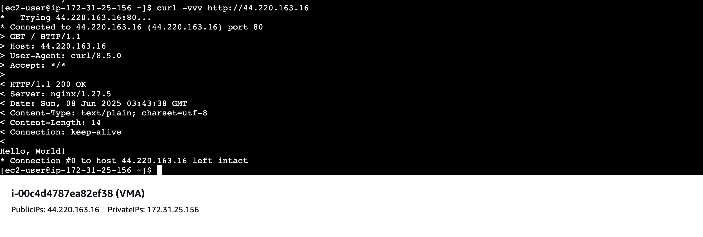
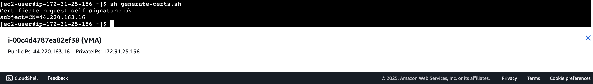
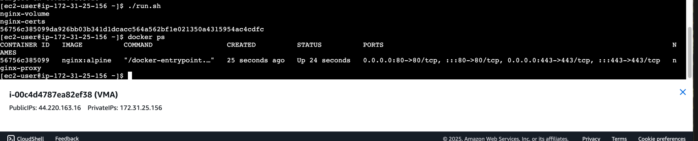
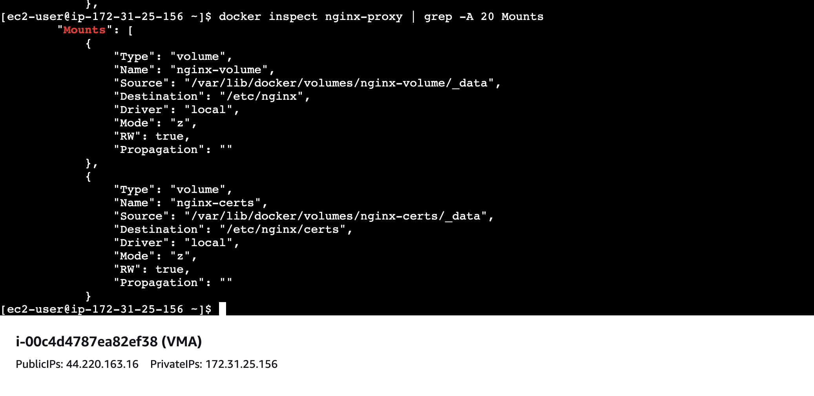
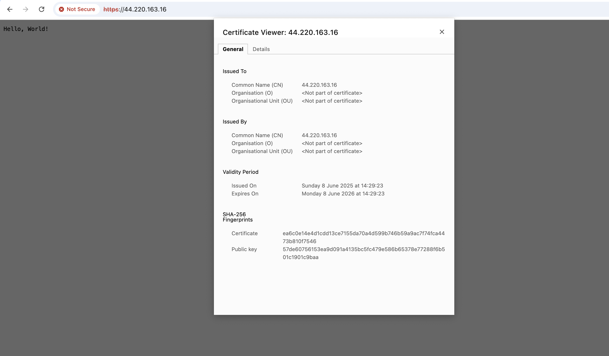
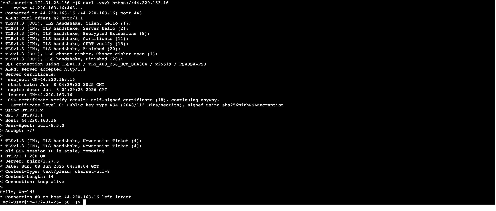

# Proxy solution using nginx without TLS 

## Run the proxy as a container on VMA.

## Configuration for the proxy attached as a volume to the container.

## Proxy accessible from outside the VM.

## Output of the curl command that hits the proxy and the response that comes from the application running on VM B.

# Proxy solution using nginx with TLS 

## Certs creation to configure the proxy with TLS.

## Run the proxy as a container on VMA.

## Configuration for the proxy certs attached as a volume to the container.

## Proxy accessible from outside the VM.

## Output of the curl command that hits the proxy and the response that comes from the application running on VM B.

